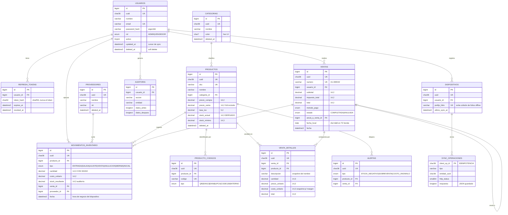

# Arquitectura — Inventario POS offline-first

> Stack verificado contra el entorno real: Flutter 3.44.1 · Dart 3.12.1 · Node.js 22.20 · **MariaDB 11.4.12**
> (el host `mysql-inventarios.alwaysdata.net` **no** corre MySQL; ver §7).

---

## 1. Principio rector

```
┌──────────────────────── DISPOSITIVO ────────────────────────┐
│                                                             │
│   UI (Riverpod)                                             │
│      │  lee streams                                         │
│      ▼                                                      │
│   SQLite / Drift  ◄────── FUENTE DE VERDAD DEL DISPOSITIVO   │
│      │  escribe outbox en la MISMA transacción              │
│      ▼                                                      │
│   sync_outbox ──► SyncEngine ──► red (si la hay)            │
└─────────────────────────────────────────────────────────────┘
                          │  ▲
                    push  │  │  pull (delta por cursor)
                          ▼  │
┌──────────────────────── SERVIDOR ───────────────────────────┐
│   Express 5 → MariaDB  ◄── FUENTE DE VERDAD DE LA ORG.      │
└─────────────────────────────────────────────────────────────┘
```

**La UI nunca hace una petición HTTP para pintarse.** Lee SQLite. La red sólo alimenta SQLite.
Consecuencia práctica: no existen los estados «cargando…» por red en las pantallas de operación, y el
modo avión no cambia absolutamente nada en la experiencia salvo el chip de sincronización.

---

## 2. Modelo entidad-relación



### Decisiones de modelado que no son obvias

| Decisión | Motivo |
|---|---|
| **`uuid` además de `id`** | El dispositivo offline no puede pedir un `AUTO_INCREMENT`. El `uuid` (v7, ordenable por tiempo) es la clave que viaja; el `id` es sólo para joins internos y rendimiento de índices. |
| **`movimientos.cantidad` con signo** | `stock = SUM(cantidad)` se vuelve trivial y correcto para `AJUSTE`, que puede ir en ambos sentidos. Con «cantidad positiva + tipo» habría que hacer un `CASE` en cada agregado. |
| **`stock_actual` en `productos`** | Es una **proyección materializada** para que la lista de 10.000 productos no haga un `SUM` por fila. Se recalcula con `sp_recalcular_stock`. La verdad sigue estando en el libro de movimientos. |
| **`venta_detalles.descripcion` y `costo_unitario` duplicados** | *Snapshot* al momento de la venta. Si mañana cambias el nombre o el costo del producto, los tickets y el margen histórico **no deben mutar**. Es un requisito contable, no una desnormalización perezosa. |
| **`ventas.fecha_local DATE`** | El servidor está en UTC y la tienda en `America/Bogota`. Sin esta columna, «ventas de hoy» partiría el día a las 7:00 p. m. Se calcula en el cliente con su zona y se persiste. |
| **`ventas.numero` con prefijo por dispositivo** | Dos cajas offline generando folios `000001` colisionarían. Cada dispositivo recibe un `prefijo_folio` único al registrarse: `A1-000042`, `B7-000042`. |
| **`producto_codigos` como tabla aparte** | La caja de 12 y la unidad suelta traen EAN distintos para el mismo producto. Un solo campo `codigo_qr` no lo soporta. |
| **Soft delete en todo** | Un `DELETE` físico nunca llegaría al dispositivo desconectado (no hay fila que sincronizar) y rompería el histórico de ventas por FK. |

---

## 3. Protocolo de sincronización

### 3.1 Escritura local (siempre, con o sin red)

```
usuario confirma venta
   │
   ▼  UNA sola transacción SQLite
   ├─ INSERT ventas_local
   ├─ INSERT venta_detalles_local
   ├─ INSERT movimientos_local  (cantidad negativa)
   ├─ UPDATE productos.stock_actual  (proyección optimista)
   └─ INSERT sync_outbox { client_op_id: uuid(), tipo:'VENTA_CREAR', payload: json }
   │
   ▼
UI actualizada por stream de Drift  ← instantáneo, sin red
```

Si la app muere entre el `INSERT` de dominio y el de la outbox, la transacción se revierte entera: **nunca**
queda una venta sin encolar ni una entrada en la cola sin venta.

### 3.2 PUSH — subida con idempotencia

```
SyncEngine                                Servidor
    │                                        │
    ├─ SELECT * FROM sync_outbox             │
    │  WHERE estado IN ('PENDIENTE','ERROR') │
    │    AND proximo_intento_at <= now       │
    │  ORDER BY id ASC LIMIT 50              │
    │                                        │
    ├──── POST /sync/push ──────────────────►│
    │     { operations: [ {client_op_id,     │  por cada operación:
    │        tipo, entidad_uuid, payload} ] }│   ┌────────────────────────────┐
    │                                        │   │ ¿existe client_op_id en    │
    │                                        │   │ sync_operaciones?          │
    │                                        │   │  SÍ → devolver respuesta   │
    │                                        │   │       guardada, NO aplicar │
    │                                        │   │  NO → BEGIN                │
    │                                        │   │       aplicar efecto       │
    │                                        │   │       INSERT sync_oper.    │
    │                                        │   │       COMMIT               │
    │                                        │   └────────────────────────────┘
    │◄──── 200 { results: [...] } ───────────┤
    │                                        │
    └─ DELETE FROM sync_outbox WHERE client_op_id IN (ok)
       UPDATE ... intentos+1, backoff  (para los que fallaron)
```

**Por qué la idempotencia es el corazón del sistema.** El escenario que arruina un POS: el cliente envía la
venta, el servidor la aplica, y la respuesta se pierde por un corte de señal. El cliente no sabe si se aplicó,
reintenta, y sin `client_op_id` **cobra dos veces y descuenta el doble de stock**. Con la tabla
`sync_operaciones` como clave primaria de la operación, el reintento devuelve el resultado original y no
vuelve a tocar nada.

**Backoff**: `min(2^intentos × 5 s, 15 min)`, con *jitter* de ±20 % para que 30 dispositivos que recuperan
la red en el mismo momento no golpeen el servidor a la vez.

**Errores permanentes** (400/409/422): la operación se marca `RECHAZADA`, sale de la cola y se muestra al
usuario en «Elementos con problema». No se reintenta eternamente algo que nunca va a pasar la validación.

### 3.3 PULL — bajada delta por cursor keyset

```http
GET /api/v1/sync/pull?cursor=<base64({"productos":{"t":"2026-08-05T10:00:00.000Z","i":842}, ...})>&limit=500
```

El servidor devuelve, por entidad:

```sql
SELECT ... FROM productos
WHERE (updated_at > :t) OR (updated_at = :t AND id > :i)
ORDER BY updated_at ASC, id ASC
LIMIT :limit
```

**Por qué keyset y no `WHERE updated_at > :t`:** varias filas pueden compartir el mismo milisegundo. Con un
cursor de sólo tiempo, al paginar se **saltan filas** (si usas `>`) o se repiten infinitamente (si usas `>=`).
El par `(updated_at, id)` es un orden total. Es el mismo motivo por el que no se usa `OFFSET`.

Los borrados llegan como filas con `deleted_at != null` — por eso el soft delete es obligatorio.

### 3.4 Resolución de conflictos

| Caso | Resolución | Justificación |
|---|---|---|
| Venta creada offline | **Siempre se acepta** | Es un hecho consumado: la mercancía ya salió y el dinero ya entró. |
| Dos dispositivos venden la última unidad | **Ambas se aceptan**; stock queda negativo; se crea `alerta.SOBREVENTA` | Rechazar la segunda descuadraría la caja contra mercancía entregada. Es la conducta de Square/Shopify POS. |
| Producto editado en dos sitios | **LWW por `updated_at`**; empate → gana el servidor | Bajo impacto y baja frecuencia. |
| `stock_actual` | **Nunca se envía como absoluto** | El cliente manda *deltas* (movimientos). El servidor recalcula y su valor gana en el pull. |
| Producto borrado en A, vendido en B | La venta **se acepta**; el producto queda borrado | El detalle guarda snapshot del nombre, así que el ticket histórico sigue siendo legible. |

### 3.5 Disparadores de sincronización

1. Arranque de la app.
2. Recuperación de conectividad (`connectivity_plus` **+ sondeo real a `/health`** — estar conectado a un wifi
   sin salida a internet es el falso positivo clásico).
3. Después de cada mutación local, con *debounce* de 3 s.
4. Temporizador de 5 min con la app en primer plano.
5. Tirón de refresco manual.
6. Botón «Sincronizar ahora» en el chip de estado.

---

## 4. Autenticación con soporte offline

```
Primer login (requiere red)
   ├─ POST /auth/login  →  { access_token 15min, refresh_token 30d, usuario }
   └─ guardar en el dispositivo:
        · access/refresh   → flutter_secure_storage (Keystore de Android)
        · argon2id(password) → SQLite local   ← permite login offline posterior
        · offline_valido_hasta = now + 7 días

Login posterior SIN red
   ├─ verificar contraseña contra el hash local
   ├─ si now > offline_valido_hasta → exigir conexión
   └─ conceder sesión local (sin JWT; el JWT sólo hace falta para hablar con la API)

Refresh rotativo
   └─ cada refresh invalida el anterior; reutilizar uno revocado revoca
      toda la familia de tokens (detección de robo de token)
```

El JWT **no** protege la app; protege la API. Por eso su expiración no puede bloquear la venta offline.

---

## 5. Estructura de carpetas

```
inventario/
├── docs/            PROMPT_MEJORADO.md · ARQUITECTURA.md · API.md
├── database/        schema.sql · seeds.sql · migrations/ · migrate.mjs
├── backend/
│   └── src/
│       ├── config/          env.js (validado con Zod) · constants.js
│       ├── db/              pool.js · tx.js · repositories/
│       ├── middleware/      auth.js · rbac.js · validate.js · error.js · rateLimit.js
│       ├── modules/
│       │   ├── auth/        controller · service · routes · schemas
│       │   ├── productos/   (+ categorías, proveedores, códigos)
│       │   ├── inventario/  movimientos, ajustes, recálculo
│       │   ├── ventas/      creación transaccional, anulación
│       │   ├── reportes/    agregados por día hábil local
│       │   ├── sync/        push (idempotente) · pull (keyset)
│       │   └── uploads/     imágenes de producto
│       ├── utils/           money.js · errors.js · logger.js · uuid.js
│       ├── app.js
│       └── server.js
└── mobile/
    └── lib/
        ├── core/
        │   ├── database/    Drift: tablas, DAOs, migraciones
        │   ├── network/     Dio, interceptores, ApiClient
        │   ├── sync/        SyncEngine · Outbox · Cursores · ConnectivityService
        │   ├── theme/       Material 3, paleta, tipografía
        │   ├── router/      go_router + guardas
        │   ├── money/       Money (entero en centavos)
        │   ├── errors/      Failure, Result
        │   └── widgets/     skeletons, estados vacíos, chip de sync
        └── features/
            ├── auth/        domain · data · presentation
            ├── dashboard/
            ├── scanner/
            ├── productos/
            ├── inventario/
            ├── ventas/
            ├── reportes/
            └── ajustes/
```

Cada *feature* replica `domain / data / presentation`:

- **domain** — entidades puras y contratos de repositorio. Sin `package:flutter`, sin `dio`, sin `drift`.
- **data** — implementación de repositorios: DAO local + fuente remota + mapeadores.
- **presentation** — providers de Riverpod, pantallas y widgets.

---

## 6. Dinero: por qué no hay ni un `double`

`0.1 + 0.2 == 0.30000000000000004`. En una venta de 40 líneas eso se convierte en descuadres de caja que nadie
puede explicar. Reglas:

| Capa | Tipo | Nota |
|---|---|---|
| MariaDB | `DECIMAL(14,2)` | Aritmética exacta en el motor. |
| Node | `string` ↔ `bigint` de centavos | `mysql2` devuelve `DECIMAL` como string: **no** hacer `parseFloat`. |
| Dart | `Money` (`int` de centavos) | Suma/resta exactas; multiplicación por cantidad con redondeo `HALF_UP` explícito. |
| JSON de la API | `string` (`"12500.00"`) | Un `number` en JSON es IEEE-754 y volvería a introducir el error. |

Cantidades en `DECIMAL(14,3)` para permitir venta por peso (0,750 kg).

---

## 7. MariaDB ≠ MySQL: lo que hubo que ajustar

Comprobado contra el servidor real (`SELECT VERSION()` → `11.4.12-MariaDB`):

| Aspecto | Impacto | Ajuste aplicado |
|---|---|---|
| `sql_mode` sin `STRICT_TRANS_TABLES` | MariaDB **trunca en silencio**: un `VARCHAR(50)` que recibe 80 caracteres guarda 50 sin error | `SET SESSION sql_mode='STRICT_TRANS_TABLES,ERROR_FOR_DIVISION_BY_ZERO,NO_ENGINE_SUBSTITUTION'` en cada conexión del pool |
| `sql_mode` sin `ONLY_FULL_GROUP_BY` | Permite `GROUP BY` ambiguos que devuelven datos arbitrarios | Se activa también por sesión; todos los agregados son explícitos |
| Colación por defecto `utf8mb4_general_ci` | No existe `utf8mb4_0900_ai_ci` (es exclusiva de MySQL 8) | Todo el DDL usa `utf8mb4_unicode_ci` |
| Tipo `JSON` | En MariaDB es alias de `LONGTEXT` con `CHECK (json_valid(...))` | Se usa `LONGTEXT` explícito; el parseo se hace en Node |
| `CHECK` constraints | Sí se aplican (a diferencia de MySQL 5.7) | Se usan para invariantes de negocio |
| Zona horaria `SYSTEM` = UTC | Reportes «del día» se cortarían a las 19:00 hora Colombia | `timezone: 'Z'` en `mysql2` + columna `fecha_local DATE` |
| `utf8mb4` + índice único en `VARCHAR` | Límite de 3072 bytes por índice; `VARCHAR(255)` utf8mb4 = 1020 bytes | Longitudes acotadas donde hay índice único |

---

## 8. Presupuestos y criterios de aceptación

| Métrica | Objetivo |
|---|---|
| Escaneo detectado → línea visible en el carrito | < 400 ms |
| Búsqueda en catálogo de 10.000 productos | < 100 ms (índice local + `LIKE` con prefijo) |
| Arranque en frío hasta dashboard usable | < 1,5 s |
| Reintento de una venta con el mismo `client_op_id` | 1 fila, 1 descuento de stock |
| Operación completa en modo avión | login + 3 ventas + ticket, sin degradación |
| `flutter analyze` | 0 advertencias |
